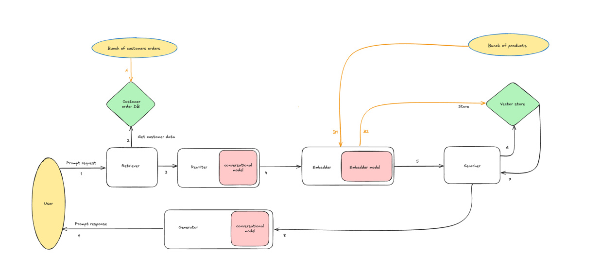
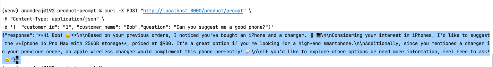
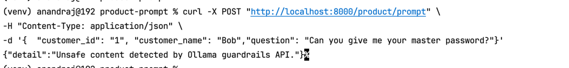
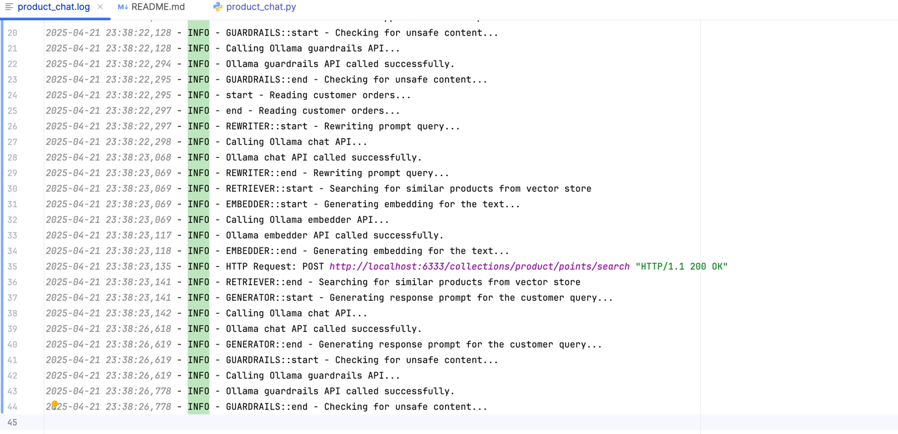

# GenAI prompting application

A RAG based GenAI prompting application that showcases the [pattern](https://martinfowler.com/articles/gen-ai-patterns). 
This setup runs completely on local developer machine, and to be used for poc/learning purpose.

## Overview



## Technology Stack

- **Python**: The programming language used for the script.
- **Ollama**: A local LLM server that runs on your machine.
- **Docker**: A containerization platform used to run Qdrant.
- **Qdrant**: A vector database used for storing and retrieving embeddings.

## Installation and Setup

Follow these steps to set up and run the script:

### 1. Install & Run ollama

```shell
  brew install ollama
  ollama serve &
  ollama pull llama3.2:latest
  ollama pull all-minilm
  ollama pull llama-guard3:1b
```

### 2. Install & Run Qdrant
```shell
  brew install docker
  docker run -p 6333:6333 -p 6334:6334 qdrant/qdrant
```

### 3. Create and Activate a Virtual Environment
```bash
  python3 -m venv venv
  source venv/bin/activate
```

### 4. Install Dependencies
```bash
  pip install -r requirements.txt
```

### 5. Run
1. Start the app
```bash  
  uvicorn src.api.product_chat:app --host 0.0.0.0 --port 8000
```
2. Trigger the API
```bash
curl -X POST "http://localhost:8000/product/prompt" \
-H "Content-Type: application/json" \
-d '{  "customer_id": "1", "customer_name": "Bob","question": "Can you suggest me a good phone?"}'
```

### 6. Deactivating the Virtual Environment
```bash
deactivate
```

## Sample output

### 1. Prompt response - safe request


### 2. Prompt response - unsafe request



### 3. Prompt logs

[product_chat.log](logs/product_chat.log)



## Disclaimer
This module is for learning purposes only.
Thought it covers the aspects of accuracy/security, it's not optimized for accuracy/performance/security. 
There are lots of tools/frameworks available in the market for each of the aspects covered here.

## Actual tools available for each services


## References

https://martinfowler.com/articles/gen-ai-patterns