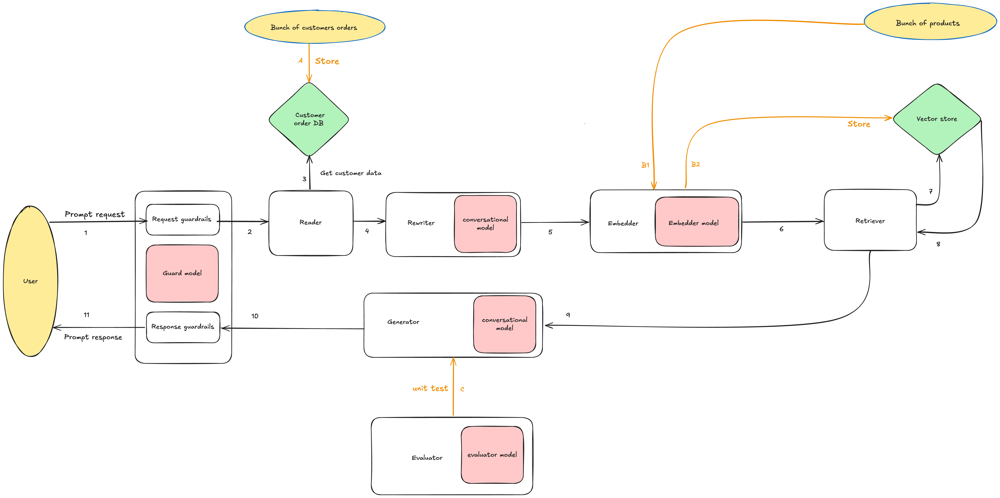

# GenAI prompting application

    A RAG based GenAI prompting application that runs completely on local developer machine, and can be used for demo/learning purpose.

## Overview



## Technology Stack

- **Python**: The programming language used for the script.
- **Ollama**: A local LLM server that runs on your machine.
- **Docker**: A containerization platform used to run Qdrant.
- **Qdrant**: A vector database used for storing and retrieving embeddings.

## Installation and Setup

Follow these steps to set up and run the script:

### 1. Install & Run ollama

```shell
  brew install ollama
  ollama serve &
  ollama pull all-minilm
```

### 2. Install & Run Qdrant
```shell
  brew install docker
  docker run -p 6333:6333 -p 6334:6334 qdrant/qdrant
```

### 3. Create and Activate a Virtual Environment
```bash
  python3 -m venv venv
  source venv/bin/activate
```

### 4. Install Dependencies
```bash
  pip install -r requirements.txt
```

### 5. Run
1. Start the app
```bash  
  uvicorn src.api.product_chat:app --host 0.0.0.0 --port 8000
```
2. Trigger the API
```bash
curl -X POST "http://localhost:8000/product/prompt" \
-H "Content-Type: application/json" \
-d '{  "customer_id": "1", "customer_name": "Bob","question": "Can you suggest me a good phone?"}'
```

### 6. Deactivating the Virtual Environment
```bash
deactivate
```

## Sample output:

### 1. Prompt response


### 2. Prompt logs

[product_chat.log](logs/product_chat.log)


## References

https://martinfowler.com/articles/gen-ai-patterns